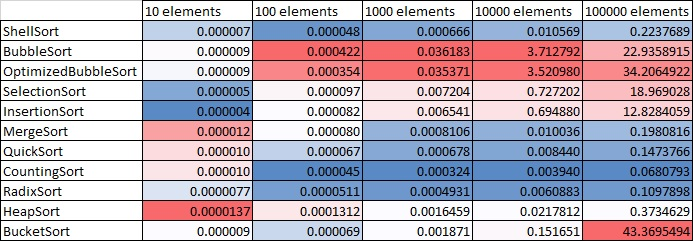

# Sort Algorithms implementation on PHP

### Next algorithms were implemented:
* Bubble sort
* Optimized bubble sort
* Bucket sort (modified for int values)
* Counting sort
* Heap sort
* Insertion sort
* Merge sort
* Quick sort
* Radix sort
* Selection sort
* Shell sort

### Environment and Measurements
Laptop with 32GB RAM was used, 11th Gen Intel(R) Core(TM) i7, 2.80GHz \
Each algorithm sorted the same 10 different arrays \
Max number in array was limited to `size * 10`

### Results
Results are average time spent (**sec**) for sorting arrays of each size for specific algorithms.
```
Ranking by speed:
1. Counting sort
2. Radix sort
3. Shell sort (Attention! This algorithm is not stable!)
4. Quick sort
5. Merge sort
```


